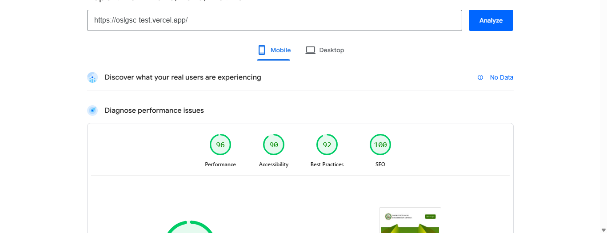

# Task

Build a voting application for users to vote for contestants in an award ceremony. 

# Solution
The application is built using Next Js, Typescript, Tailwind and Firebase. The application has a the landing page, the nominee details page, the vote details page, the success page, and the leaderboard. 

The landing page was separated into different components for different sections of the page - showing a countdown timer till vote completion, how to vote, rules of voting, a preview of the leaderboard page, and a list of the contestants and the category they are being voted for.

The contestants' details is saved in firebase and fetched using Context API. Images are stored in firestore, with links to their location being stored to be fetched with other details. Contestants can have as many votes as possible, and voting for multiple contestants in the same category is permitted. Each contestant has a link to a page that shows their details in full, with an input field to input the amount of votes to be allocated and also counters to increase and decrease the number of votes. 

There is a modal confirming that the user has placed their votes, and a modal that informs the users if they haven't made a vote yet and they tried to click the Pay Now button. 

The Pay Now button takes you to a vote summary page that shows the total votes you made and how the total amount to be paid for the votes at 100 naira per vote. There's also an input field for the user to enter their email address. The button to pay calls the Paystack API that handles the payment transcation. A webhook was deployed to automate the routing to the success page and addition of votes per contestant to firebase.

The success page shows appreciation and has a button take users back to the home page. 

The preview to the leaderboard has a link to the leaderboard which ranks all categories according to their total votes, and ranks each contestant in each category according to their votes.

The admin section has a login page and a dashboard. The login details for each admin desired were created by the developer, users can't create an admin account. The dashboard contained the total number of votes, total number of contestants and total number of categories being voted for. It also contains the leaderboard rankings.

The application was built to be responsive across different screen sizes.

# Optimization

To achieve a lighthouse score of 96% on mobile devices, the context for voting and admin were separated so that they are both only called when needed. Initially, the authentication for firebase had to be called before first contentful paint, delaying page load by about 1200ms. Also, vote context was being called before page load to get nominees by their categories and in the leaderboard. By separating them, the vote context now wraps only components that need it, and is called after page load but is pre-fetched before the user navigates to that section. Same with the admin context, the authjs/iframe is called after FCP and pre-fetched before the user goes to the admin page.

Web sockets has been added to give live updates as votes are coming in, to increase the competitive edge and to give users better conviction that votes are actually counting.